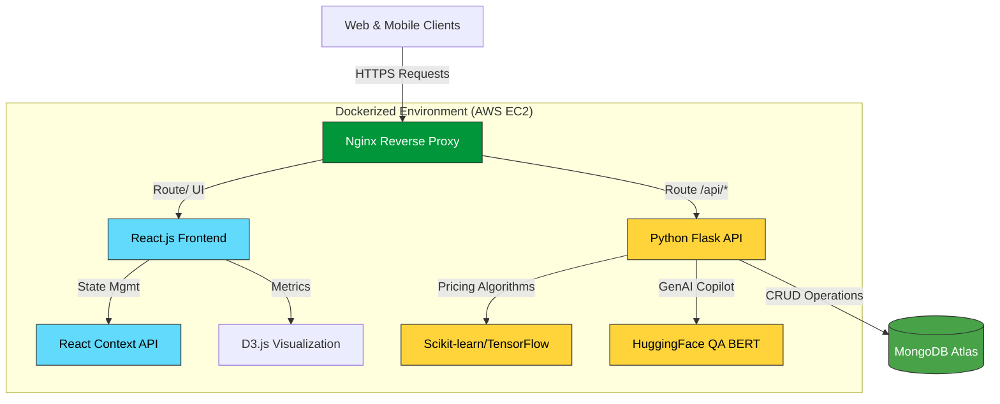
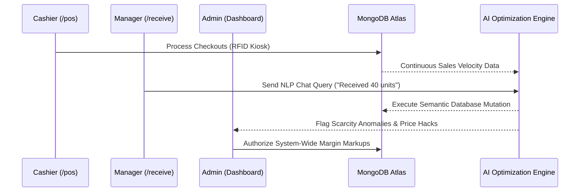

# 🧠 Genius: ML-Powered Retail Logistics & Dynamic Pricing

## Project Description
A comprehensive, full-stack application designed to optimize in-store inventory and dynamic pricing for markdown events. This system empowers retail staff to make data-driven decisions on stock levels and dynamic pricing to prevent overstocking and stockouts.

## System Architecture

The Genius platform operates on a robust, microservices-oriented architecture deployed on AWS EC2, featuring real-time AI integration.



## Data Flow & Multi-Role Access

The platform utilizes a multi-interface Role-Based Access Control (RBAC) system to securely route live data between operational staff and the centralized ML engine.



## Setup Instructions

### Prerequisites
- Python 3.9+
- Node.js & npm
- MongoDB Atlas cluster

### Local Development Setup

1. **Clone the repository** (or use the provided source code).

2. **Environment Variables**:
   Copy `.env.example` to `.env` in the root directory and update your values (like `MONGO_URI`).

3. **Backend & ML Engine Setup**:
   ```bash
   cd backend
   python -m venv venv
   source venv/bin/activate  # On Windows: venv\Scripts\activate
   pip install -r requirements.txt
   flask run
   ```

4. **Frontend Setup**:
   ```bash
   cd frontend
   npm install
   npm run dev
   ```

## License
This project is licensed under the [MIT License](LICENSE).